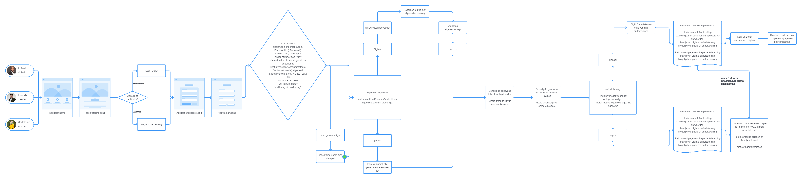
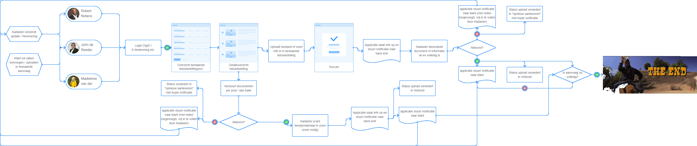
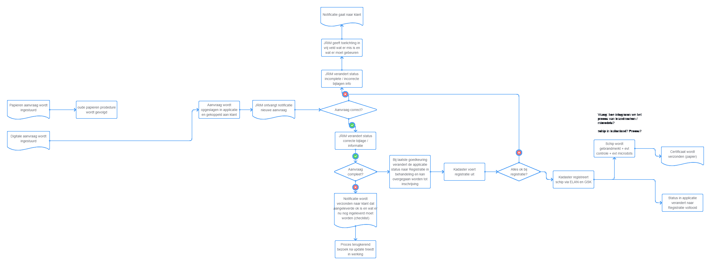
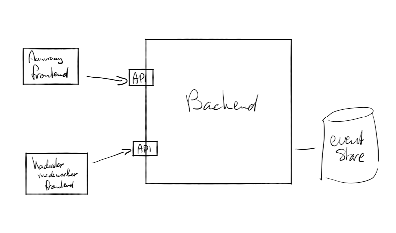

# ShipReg, the Ship Registry | Home

This is the home of 'ShipReg', the Ship Registry of The Netherlands ... well, the first set up of an **event-sourced** approach of it :-)

Keep posted for further development!

## Starting Point

The current process exists by MS Word docs which need to be filled and send in, including some (to me) bizar 'ping-pong' between parties to finish the whole flow. This is described in the 'starting point' documentation:

- [Registreren Schip - teboekstelling Schip (oud en nieuw proces + persona's)](docs/InformatieInnovationFriday-RegistrerenSchip-teboekstellingSchip.pdf)
- [Feature Matrix - teboekstelling Schip](docs/FeatureMatrixModelTeboekstellingSchip.xlsx)

The forms can be found at the current operational process locations:

- [kadaster.nl/aanvragen-teboekstelling-schip](https://www.kadaster.nl/aanvragen-teboekstelling-schip)
- [ILenT/aanvraag-registratie-pleziervaartuigen](https://www.ilent.nl/onderwerpen/pleziervaart/documenten/formulieren/2016/10/24/formulier-aanvraag-registratie-pleziervaartuigen)

These are the new proposed processes:

## Design

So there are multiple parties involved in the whole process. The new designed process suggests an easier flow and collection of information but still this contains multiple parties in multiple steps. How might this be separated into separate systems working together?

---

## Find Us

* [GitHub](https://github.com/marcvanandel/ShipReg-home)

## Contributing

Please read [CONTRIBUTING.md](CONTRIBUTING.md) for details on our code of conduct, and the process for submitting pull requests to us.

## Maintainers 

Should you have any questions or concerns, please reach out to one of the project's [Maintainers](./MAINTAINERS.md).

## License

This work is licensed under a [EUPL v1.2 license](./LICENSE.md). All documentation is licensed under [CC BY 4.0](https://creativecommons.org/licenses/by/4.0/)

## Attribution

* Logo: sinking ship by Ian Rahmadi Kurniawan from the Noun Project
